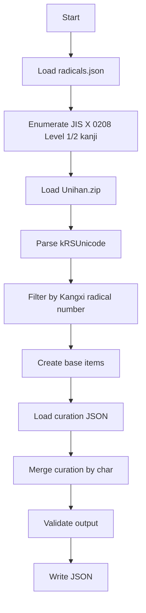

# JIS第一・第二水準 部首別漢字JSON生成ツール 設計書

作成日: 2026-06-22  
版: Draft 0.1

## 1. 目的

JIS X 0208の第一・第二水準漢字を対象に、指定した部首ごとの漢字一覧をJSONデータとして生成する。

主な用途は、海外の日本語・漢字好き向けに「魚へん」「糸へん」「草かんむり」「木へん」などのテーマ別漢字リストを作成し、文字・Unicode・読み・英語名・文化的説明を付与できるようにすること。

最初のMVPでは、部品位置の厳密判定ではなく、Unicodeの部首情報を使った「部首検索」を中心にする。将来的に、IDSデータを使って「魚 + 春」「Fish + Spring」のような構成要素検索も追加できる設計にする。

## 2. 背景と前提

### 2.1 対象文字集合

対象はJIS X 0208の漢字領域とする。

- 第一水準: 16区から47区
- 第二水準: 48区から84区
- 合計: 6,355字

Pythonでは、区点をEUC-JPの2バイト列として復号することで、JIS第一・第二水準の漢字とUnicodeコードポイントを取得できる。

### 2.2 部首と部品の違い

本ツールでは、次の2種類を区別する。

| 種別 | 例 | 説明 | MVPでの扱い |
|---|---|---|---|
| 部首検索 | 鰆, 鮪, 鯛 | Unicode/辞書上の部首が魚である漢字 | 対応する |
| 部品検索 | 漁 | 部首は水だが、構成要素として魚を含む漢字 | 将来拡張 |

たとえば「漁」は見た目には「氵 + 魚」だが、部首は水である。そのためMVPの「魚へん」データには含めない。必要になったらIDSによる部品検索で扱う。

### 2.3 「魚へん」などの表示名

ユーザー向けの見出しとしては「魚へん」「糸へん」「草かんむり」のような親しみやすい名前を使う。ただし内部的には、曖昧さを避けるため康熙部首番号で管理する。

例:

| id | 表示名 | 英語名 | 部首 | 康熙部首番号 |
|---|---|---|---|---:|
| fish | 魚へん | Fish radical | 魚 | 195 |
| bird | 鳥へん | Bird radical | 鳥 | 196 |
| thread | 糸へん | Thread radical | 糸 | 120 |
| grass | 草かんむり | Grass radical | 艸 / 艹 | 140 |
| tree | 木へん | Tree / Wood radical | 木 | 75 |
| metal | 金へん | Metal radical | 金 | 167 |
| insect | 虫へん | Insect radical | 虫 | 142 |

## 3. 参照データ

### 3.1 JIS第一・第二水準の列挙

外部のJIS一覧表を必須にせず、Pythonの文字コード変換で列挙する。

```python
for ku in range(16, 85):
    for ten in range(1, 95):
        try:
            ch = bytes([ku + 0xA0, ten + 0xA0]).decode("euc_jp")
        except UnicodeDecodeError:
            continue

        level = 1 if ku <= 47 else 2
        unicode_value = f"U+{ord(ch):04X}"
        kuten = f"{ku:02d}-{ten:02d}"
```

### 3.2 Unicode Unihan

部首判定にはUnicodeのUnihanデータを使う。

- 参照: https://www.unicode.org/reports/tr38/
- データ: https://www.unicode.org/Public/UCD/latest/ucd/Unihan.zip
- 使用プロパティ: `kRSUnicode`

`kRSUnicode`は、漢字ごとの部首番号と残画数を持つ。生成時には、値の先頭にある康熙部首番号を抽出し、指定部首番号と照合する。

### 3.3 IDSデータ

将来拡張として、構成要素や位置を調べるためにIDSデータを使う。

- 参照: https://github.com/cjkvi/cjkvi-ids

用途:

- `魚 + 春` のような構成要素を抽出する
- 左右構造、上下構造を推定する
- 「部首は水だが魚を含む」漢字を別カテゴリとして扱う

MVPではIDSは必須にしない。

## 4. 機能要件

### 4.1 MVP要件

| ID | 要件 |
|---|---|
| FR-001 | JIS第一・第二水準の漢字を列挙できる |
| FR-002 | 各漢字のUnicodeコードポイントを出力できる |
| FR-003 | 各漢字のJIS水準と区点を出力できる |
| FR-004 | Unihan `kRSUnicode`を読み込み、指定した康熙部首番号で絞り込める |
| FR-005 | 部首定義ファイルから、`fish`, `thread`, `grass`などのグループを指定できる |
| FR-006 | 機械生成データに、人手編集のキュレーションデータを重ねられる |
| FR-007 | JSONを決定的な順序で出力できる |
| FR-008 | 生成結果を検証し、重複・不正なUnicode・キュレーション対象外文字を警告できる |

### 4.2 将来要件

| ID | 要件 |
|---|---|
| FR-101 | IDSを使って、構成要素として魚・鳥・木などを含む漢字を検索できる |
| FR-102 | IDSを使って、左側・右側・上側などの位置ラベルを推定できる |
| FR-103 | 「寿司ネタ」「植物」「縁起物」「季節」などの意味カテゴリを付与できる |
| FR-104 | 英語・日本語・ローマ字の表示用データを分離して管理できる |
| FR-105 | Web表示用に、グループ別・タグ別・検索用インデックスを生成できる |

## 5. 非機能要件

| ID | 要件 |
|---|---|
| NFR-001 | 出力はUTF-8で保存する |
| NFR-002 | 入力データのバージョンまたは取得URLをメタデータに残す |
| NFR-003 | 同じ入力から同じ順序のJSONを生成する |
| NFR-004 | ネットワークがなくても、ローカル保存済みのUnihan.zipから生成できる |
| NFR-005 | 機械生成項目と人手編集項目を分離し、再生成で手編集が消えないようにする |
| NFR-006 | JSONはアプリ、静的サイト、翻訳作業で扱いやすい構造にする |

## 6. ディレクトリ構成案

```text
radical-kanji-data/
  README.md
  data/
    radicals.json
    curation/
      fish.json
      bird.json
      thread.json
      grass.json
      tree.json
    vendor/
      Unihan.zip
      ids.txt
  scripts/
    generate_radical_json.py
    validate_output.py
  outputs/
    fish.json
    bird.json
    thread.json
    grass.json
    tree.json
```

## 7. 部首定義ファイル

`data/radicals.json`

```json
[
  {
    "id": "fish",
    "labelJa": "魚へん",
    "labelEn": "Fish radical",
    "radical": "魚",
    "displayRadical": "魚",
    "kangxiRadicalNumber": 195,
    "themeTags": ["fish", "seafood", "sushi"]
  },
  {
    "id": "grass",
    "labelJa": "草かんむり",
    "labelEn": "Grass radical",
    "radical": "艸",
    "displayRadical": "艹",
    "kangxiRadicalNumber": 140,
    "themeTags": ["plant", "flower", "nature"]
  }
]
```

## 8. 出力JSONスキーマ案

### 8.1 グループ単位の出力

`outputs/fish.json`

```json
{
  "schemaVersion": "0.1",
  "generatedAt": "2026-06-22T00:00:00+09:00",
  "source": {
    "characterSet": "JIS X 0208 Level 1 and Level 2",
    "jisMethod": "EUC-JP decode from kuten rows 16-84",
    "unihan": {
      "property": "kRSUnicode",
      "sourceUrl": "https://www.unicode.org/Public/UCD/latest/ucd/Unihan.zip"
    }
  },
  "group": {
    "id": "fish",
    "labelJa": "魚へん",
    "labelEn": "Fish radical",
    "radical": "魚",
    "displayRadical": "魚",
    "kangxiRadicalNumber": 195
  },
  "items": []
}
```

### 8.2 item単位の出力

```json
{
  "char": "鰆",
  "unicode": "U+9C06",
  "codePoint": "9C06",
  "jis": {
    "standard": "JIS X 0208",
    "level": 2,
    "kuten": "82-54"
  },
  "radical": {
    "char": "魚",
    "labelJa": "魚へん",
    "labelEn": "Fish radical",
    "kangxiRadicalNumber": 195
  },
  "readings": {
    "ja": ["さわら", "サワラ"],
    "romaji": ["sawara"]
  },
  "meanings": {
    "en": ["Japanese Spanish mackerel"],
    "needsReview": true
  },
  "components": [
    {
      "char": "魚",
      "labelEn": "fish"
    },
    {
      "char": "春",
      "labelEn": "spring"
    }
  ],
  "componentPhrase": {
    "ja": "魚 + 春",
    "en": "Fish + Spring"
  },
  "notes": [
    {
      "lang": "en",
      "text": "In Japan, sawara is often associated with spring and is regarded as a seasonal fish that heralds the arrival of spring.",
      "status": "draft"
    }
  ],
  "tags": ["fish", "spring", "food"],
  "curationStatus": "draft"
}
```

## 9. キュレーションファイル

機械生成で確実に出せる情報と、人間が確認したい説明文・英語名・文化メモを分ける。

`data/curation/fish.json`

```json
{
  "鰆": {
    "readings": {
      "ja": ["さわら", "サワラ"],
      "romaji": ["sawara"]
    },
    "meanings": {
      "en": ["Japanese Spanish mackerel"],
      "needsReview": true
    },
    "components": [
      { "char": "魚", "labelEn": "fish" },
      { "char": "春", "labelEn": "spring" }
    ],
    "componentPhrase": {
      "ja": "魚 + 春",
      "en": "Fish + Spring"
    },
    "notes": [
      {
        "lang": "en",
        "text": "In Japan, sawara is often associated with spring and is regarded as a seasonal fish that heralds the arrival of spring.",
        "status": "draft"
      }
    ],
    "tags": ["fish", "spring", "food"],
    "curationStatus": "draft"
  }
}
```

### 9.1 マージ方針

生成時には次の順でitemを作る。

1. JIS/Unicode/部首情報からベースitemを作る
2. `char`をキーにキュレーションデータを検索する
3. 見つかった場合、読み・英語名・説明・タグを上書きまたは追加する
4. キュレーションがないitemは、空欄または`curationStatus: "unreviewed"`として出力する

## 10. CLI設計

### 10.1 単一部首生成

```bash
python scripts/generate_radical_json.py \
  --radical fish \
  --radicals data/radicals.json \
  --unihan data/vendor/Unihan.zip \
  --curation data/curation/fish.json \
  --out outputs/fish.json
```

### 10.2 全部首生成

```bash
python scripts/generate_radical_json.py \
  --all \
  --radicals data/radicals.json \
  --unihan data/vendor/Unihan.zip \
  --curation-dir data/curation \
  --out-dir outputs
```

### 10.3 オプション

| オプション | 説明 |
|---|---|
| `--radical fish` | 生成対象の部首id |
| `--all` | `radicals.json`の全グループを生成 |
| `--format json` | 出力形式。将来`csv`も追加可能 |
| `--include-unreviewed` | キュレーション未編集の文字も出力 |
| `--reviewed-only` | キュレーション済みの文字だけ出力 |
| `--sort jis` | JIS区点順でソート |
| `--sort unicode` | Unicode順でソート |

## 11. 生成処理フロー



## 12. 検証ルール

| ID | 検証 |
|---|---|
| VAL-001 | `char`は1文字の漢字である |
| VAL-002 | `unicode`は`char`の実際のコードポイントと一致する |
| VAL-003 | JIS区点が重複しない |
| VAL-004 | 同じ`char`が重複しない |
| VAL-005 | `jis.level`は1または2である |
| VAL-006 | `radical.kangxiRadicalNumber`はグループ定義と一致する |
| VAL-007 | キュレーションに存在する文字が、対象JIS集合に存在しない場合は警告する |
| VAL-008 | `needsReview: true`の項目を一覧表示できる |

## 13. MVPの実装順序

### Phase 1: ベース生成

- JIS第一・第二水準の列挙
- Unicodeコードポイント出力
- JIS水準・区点出力
- Unihan `kRSUnicode`による部首フィルタ
- `fish.json`の生成

### Phase 2: 複数部首対応

- `radicals.json`を導入
- `fish`, `bird`, `thread`, `grass`, `tree`などを生成
- `--all`対応

### Phase 3: キュレーション対応

- `data/curation/*.json`を読み込む
- 読み、ローマ字、英語名、文化メモ、タグをマージ
- `needsReview`と`curationStatus`を出力

### Phase 4: 拡張データ

- IDSによる構成要素検索
- `魚 + 春`などの自動推定
- Web表示用インデックス生成
- CSV出力

## 14. スコープ外

MVPでは次を扱わない。

- JIS X 0213の第三・第四水準
- Unicode全漢字
- 部品位置の厳密判定
- 漢字の読みの完全自動取得
- 魚名・植物名・英語名の完全自動翻訳
- シンメトリー判定

## 15. リスクと注意点

### 15.1 部首名と見た目のズレ

「魚へん」という表示名でも、実際には部首が魚の漢字を出す。左側に魚がある字だけとは限らない。UIやREADMEでは「辞書上の部首による分類」と明記する。

### 15.2 英語名の揺れ

魚名や植物名の英語には揺れがある。例として「鰆」は`Spanish mackerel`だけでよいか、`Japanese Spanish mackerel`にするか確認が必要。キュレーションデータには`needsReview`を持たせる。

### 15.3 Unicodeと字体

Unicodeコードポイントは文字の符号位置であり、表示字体はフォントに依存する。表示確認には日本語フォントを使う。

### 15.4 データライセンス

Unihan、CJKVI IDS、辞書データを利用する場合は、それぞれのライセンスと再配布条件を確認する。生成物に外部データ由来の説明文をそのまま入れる場合は特に注意する。

## 16. 完成イメージ

最終的には、次のようなデータを部首ごとに出せる状態を目指す。

```json
{
  "group": {
    "id": "fish",
    "labelJa": "魚へん",
    "labelEn": "Fish radical"
  },
  "items": [
    {
      "char": "鰆",
      "unicode": "U+9C06",
      "jis": {
        "level": 2,
        "kuten": "82-54"
      },
      "readings": {
        "ja": ["さわら", "サワラ"],
        "romaji": ["sawara"]
      },
      "meanings": {
        "en": ["Japanese Spanish mackerel"],
        "needsReview": true
      },
      "componentPhrase": {
        "en": "Fish + Spring"
      },
      "notes": [
        {
          "lang": "en",
          "text": "In Japan, sawara is often associated with spring and is regarded as a seasonal fish that heralds the arrival of spring."
        }
      ]
    }
  ]
}
```

## 17. まとめ

まずは「JIS第一・第二水準」かつ「Unicode/Unihanの部首番号」で絞り込むツールを作る。これにより、魚へん・糸へん・草かんむり・木へんなどの基礎データを安定して生成できる。

その上で、読み・英語名・文化的説明・寿司ネタや植物などのテーマタグはキュレーションJSONとして重ねる。これにより、機械生成の再現性と、海外向けコンテンツとしての面白さを両立できる。
